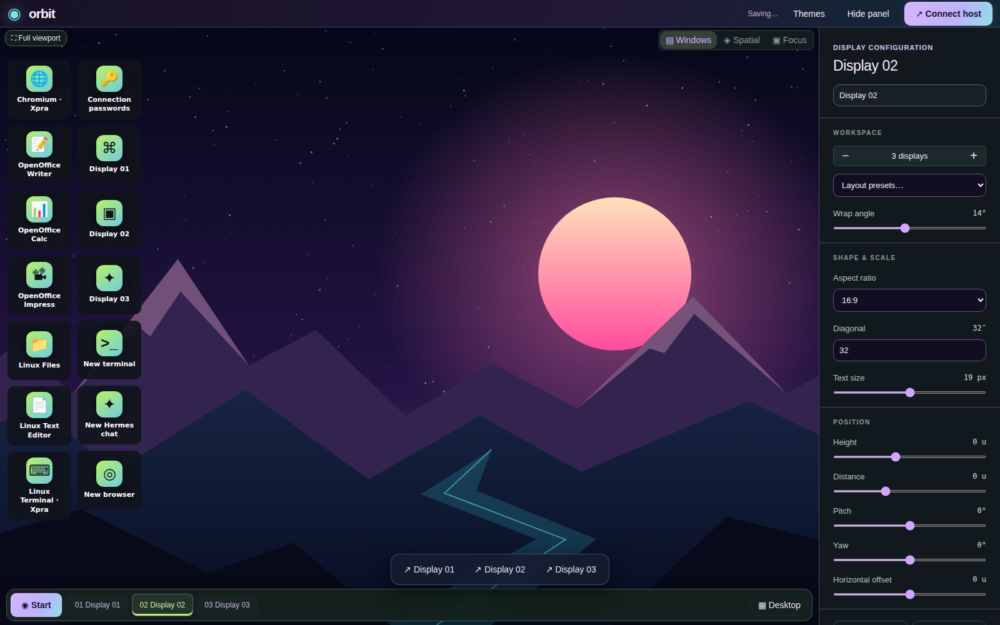
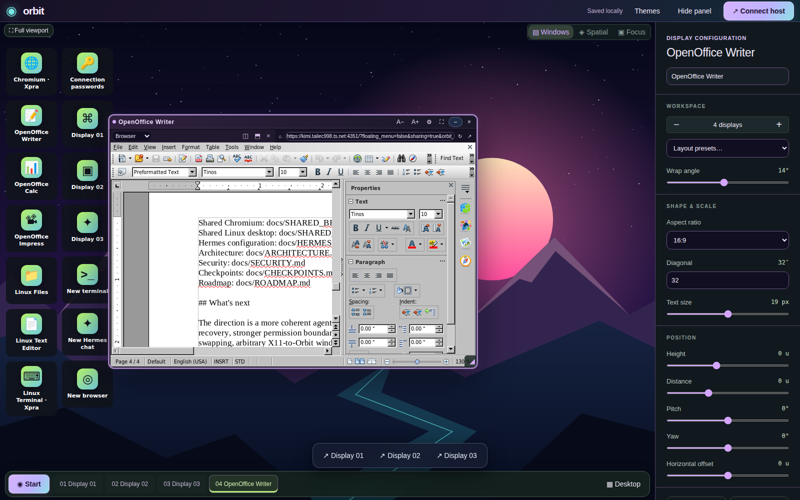
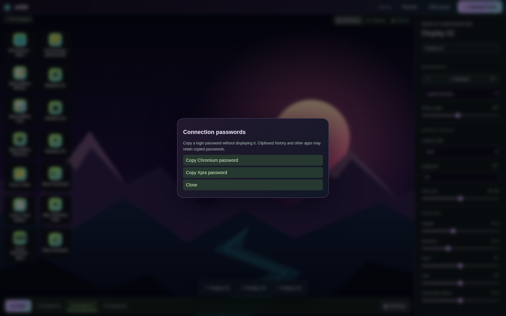

# Orbit Desktop

A private desktop you can build with your AI agent.

Orbit brings Hermes conversations, persistent host terminals, web tools, and real Linux applications into one browser workspace. Launch a document editor, research in Chromium, work in a shell, and ask Hermes to build the next tool you need—without leaving your desktop.

**Local-first · Single-owner · Agent-operated · Yours to shape.**

[Quick start](#quick-start) · [Linux apps](docs/XPRA_APPS.md) · [Agent guide](docs/AGENT_GUIDE.md) · [Security](docs/SECURITY.md)

## More than a chat window

Most AI interfaces end at an answer. Orbit gives the agent a workspace in which to act: create a small application, place it beside your work, configure its behavior, and help you use it. You remain in control of the files, services, credentials, and deployment.

Use familiar movable windows or switch to a spatial view. Keep an editor next to your terminal and your conversation. Desktop shortcuts bring applications back without requiring you to reconstruct the workspace.

Orbit is actively developed software, not a finished operating system or a multi-user cloud desktop. Some integrations require separate setup. The boundaries below are part of the product, not fine print.

## What you can do

### Launch real Linux applications

The optional Xpra integration provides desktop shortcuts for Chromium, Apache OpenOffice Writer, Calc and Impress, a file manager, a text editor, and a Linux terminal. Each application opens in a movable, resizable Orbit window.

These are native Linux programs running in containers, displayed through Xpra's HTML5 client—not applications compiled to WebAssembly and not VNC streams. Each launcher has its own Xpra session. Application menus and dialogs remain inside that application's viewer; Orbit does not yet map every X11 child window to a separate desktop window.

The apps have separate persistent home directories and a shared Documents volume. Closing the Orbit viewer does not quit the Linux application. Reopening reconnects; quitting inside the app ends the application. A host reboot loses running application state, while named-volume files persist.

Setup and limitations: [per-app launchers](docs/XPRA_APPS.md) and [Xpra deployment](docs/XPRA.md).

### Work with Hermes where the work happens

Use separate conversations in separate panes. Inspect tool activity, guide an active run, respond to approvals, and use supported scheduling controls. Available features depend on the configured Hermes gateway.

Ask for concrete changes: “Build a timer beside my editor,” “Arrange my research workspace,” or “Change this widget without losing its old version.” Hermes receives the active workspace context and an operator guide for scoped, revision-checked changes.

### Keep your shells alive through reloads

Host terminals use tmux-backed sessions identified by stable pane IDs. Reload Orbit, unlock host access, and reconnect to the same shell. Closing a pane detaches its shell; typing exit ends it. Running processes do not survive host reboot automatically.

The Xpra Linux Terminal is different: it runs inside its application container, not as a host shell.

### Build small tools as sandboxed plugins

Publish static HTML, CSS, and JavaScript as versioned app plugins. Install disabled, test, enable, configure, update, and roll back entry references through workspace checkpoints. Content-addressed bundles keep older versions available when their files are retained.

Plugins run in sandboxed iframes. They do not receive host credentials or a privileged host bridge. Do not include secrets, private documents, or personal reports in publicly served bundles or URL-fragment configuration.

### Shape the desktop around your work

Desktop icons open existing windows, restore minimized applications, and launch configured integrations. The Desktop control reveals shortcuts without closing running applications. The old eight-window cap has been removed; resource constraints and other validation limits still apply.

Move, resize, split, reorder, and arrange windows. Adjust supported colors, wallpaper, corners, spacing, and chrome. Full viewport hides surrounding controls; it is not browser fullscreen. Core frontend changes still require loading the updated frontend once.

### Recover workspace changes deliberately

Revision-checked controller mutations and supported plugin changes create checkpoints. Restore layout, appearance, plugin registrations, configuration, and entry references.

Checkpoints are not filesystem backups. They do not restore documents, shell processes, conversations, container state, emails, or other external effects.

## Hermes plugin integration

Orbit includes a native Hermes agent plugin in [`hermes-plugin/`](hermes-plugin/README.md). It registers one `orbit_workspace` tool for scoped workspace reads, previews, revision-checked edits, history, checkpoints and confirmed restores. It defaults to read-only and requires an explicitly configured local workspace; no credentials are pasted into chat and no services start automatically.

The Hermes catalog submission is pending review. The plugin now bundles Orbit's reviewed source and an explicit setup/start CLI: no separate repository clone is needed. See the [activation guide](hermes-plugin/README.md) for installation, two-command setup/start, prerequisites and trust boundaries. Orbit opens in a browser, not inside the Hermes Desktop Electron renderer. Xpra and its Linux desktop shortcuts remain optionally provisioned integrations; their source and deployment instructions are included.

## Everyday workflows

Writing and research: open Writer and Chromium beside Hermes. Develop an outline, check sources, and save the document to the Linux apps' shared Documents folder.

Software development: combine persistent host terminals, project documentation, agent conversations, and a custom status widget. Rearrange panes without recreating terminal IDs.

Personal tools: ask Hermes to build a focused timer, notes panel, calculator, or project dashboard. Test the published app before enabling it and keep an older bundle for recovery.

Linux applications from a browser: use the Xpra launchers for documents, spreadsheets, presentations, and files. Reconnect to applications after closing their viewer without starting a whole remote desktop session.

Shared visual work: use the separately configured Shared Chromium or shared Linux desktop when a common browser or complete desktop is useful. These are distinct sessions from the per-app Xpra launchers, with different storage and control paths.

## Built together: game assets and voice production

Orbit has been used to build a COCS asset-observatory plugin and an OmniVoice experiment bench alongside a real game project. The workflow combines repository inspection, a purpose-built asset viewer, voice generation with multiple seeds, auditioning, and reviewable changes to game assets. These are separately configured project integrations—not services automatically installed by the base quick start. The announcer asset PR is [mojomast/cocs#1](https://github.com/mojomast/cocs/pull/1); its existence is not a claim that every generated sound is wired into gameplay.

## Quick start

The verified target is Linux with an ordinary user account, Node.js 22.12 or newer, npm, Python 3, and tmux at /usr/bin/tmux. Native node-pty builds may also require make and a C++ compiler.

Clone https://github.com/mojomast/orbitdesktop.git, enter the repository, then run:

    npm ci
    npm run build
    npm start

Open http://127.0.0.1:4318. Choose Connect host, enter the server's host-access token, and connect a shell. Without a configured ORBIT_TOKEN, the server generates a token on startup.

Host access grants a real shell as the server's operating-system user. Do not run Orbit as root or expose it directly to the public Internet.

Start the Hermes API server separately and configure its base URL and API key on the Orbit server. See docs/HERMES.md. The agent's tools need access to the repository and runtime for local workspace control.

The base setup does not automatically provision Xpra, OpenOffice, Shared Chromium, or the shared Linux desktop. Follow their deployment guides separately. The current Xpra app deployment requires Docker and uses private Tailscale HTTPS endpoints; adapt installation-specific paths and settings rather than copying credentials or private hostnames.

## Launching and reconnecting to Linux apps

After Xpra services are configured and the current frontend is loaded, reveal the desktop and select an application shortcut. Authenticate when the Xpra viewer asks.

On deployments with the Connection passwords integration, unlock Orbit host access and use Copy Xpra password. Passwords should not be placed in workspace URLs, screenshots, app bundles, or documentation. Clipboard managers may retain copied credentials.

Save shared work in Documents. The Xpra Documents volume is separate from the existing VNC desktop's files. Closing a viewer is not the same as quitting the application, and a workspace checkpoint does not back up your document.

## Security and honest boundaries

Orbit is a powerful single-owner workspace, not an isolation boundary between mutually untrusted users. Keep the server on loopback and use private authenticated remote access. Do not expose Docker, X11, VNC, or browser-debugging sockets publicly.

The current per-app Xpra setup disables clipboard synchronization, file transfer, audio, webcam, printing, and arbitrary client-requested command launching. Each app runs as a non-root user in a restricted container. Network egress remains enabled, and shared documents are accessible to the apps that mount that volume.

The Xpra Chromium launcher currently requires --no-sandbox under the deployed container policy. Its internal Chromium sandbox is therefore not a security boundary. Do not treat it as a high-security browser or store sensitive browsing credentials there. Its profile is separate from Shared Chromium.

Shared Chromium and the full shared Linux desktop remain separate integrations; adding Xpra does not silently migrate or replace them. Remote-app rendering is not browser-local execution. Container restart policies are not guarantees that unsaved application state survives a reboot.

## Architecture

The browser frontend uses TypeScript, Vite, and Three.js/CSS3D. The Node.js server provides authenticated host access, workspace state, and integration routes. Hermes supplies the agent runtime through its API bridge.

Workspace operations manage revisioned layout and checkpoints. Sandboxed plugins supply static tools. Host terminals connect through node-pty and tmux. Optional Xpra services deliver containerized Linux applications through separate authenticated browser viewers.

Generated plugins are not trusted backend extensions. Host services and core changes require explicit trust, source review, testing, and deployment.

## Development and verification

Run npm run check for typechecking, the production build, and Node tests. Run python3 tests/plugin-publish.test.py for publisher checks.

Live browser tests under tests/ exercise integrations separately and require a configured deployment. Passing a build alone does not prove an app rendered or that a live browser applied a workspace mutation. Verify real interaction, reconnect behavior, and saved results before reporting success.

Preserve the owner's uncommitted changes, existing pane IDs, running sessions, and older plugin bundles. Never commit .runtime, tokens, transcripts, or private screenshots.

The fresh screenshots above were captured from an isolated browser workspace using `scripts/capture_xpra_readme.py`. The Writer image connects to the existing native application to show the owner-approved README draft. No conversations, passwords, or host terminal buffers were staged for publication.

## Documentation map

Agent operations: docs/AGENT_GUIDE.md
Workspace controller: docs/WORKSPACE_CONTROL.md
Plugin lifecycle: docs/PLUGINS.md
Linux app launchers: docs/XPRA_APPS.md
Xpra pilot and deployment: docs/XPRA.md
Shared Chromium: docs/SHARED_BROWSER.md
Shared Linux desktop: docs/SHARED_DESKTOP.md
Hermes configuration: docs/HERMES.md
Architecture: docs/ARCHITECTURE.md
Security: docs/SECURITY.md
Checkpoints: docs/CHECKPOINTS.md
Roadmap: docs/ROADMAP.md

## What's next

The direction is a more coherent agent-operated desktop: better application integration, clearer persistence and recovery, stronger permission boundaries, and easier deployment. Full multi-user isolation, universal backend hot-swapping, arbitrary X11-to-Orbit window mapping, and reboot-persistent running shells are not promised as shipped features.

Build the workspace you need. Keep the ability to understand it, change it, and recover it.
