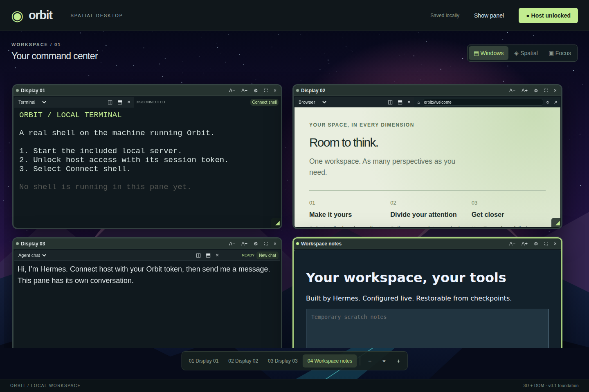
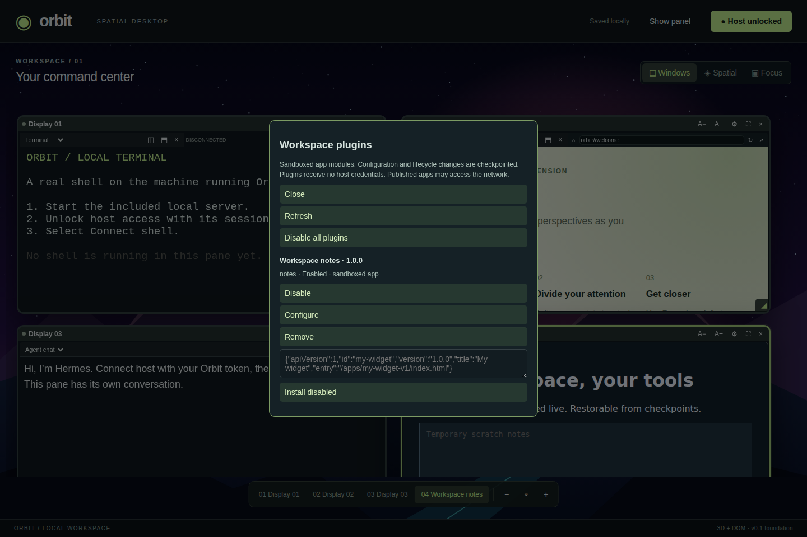
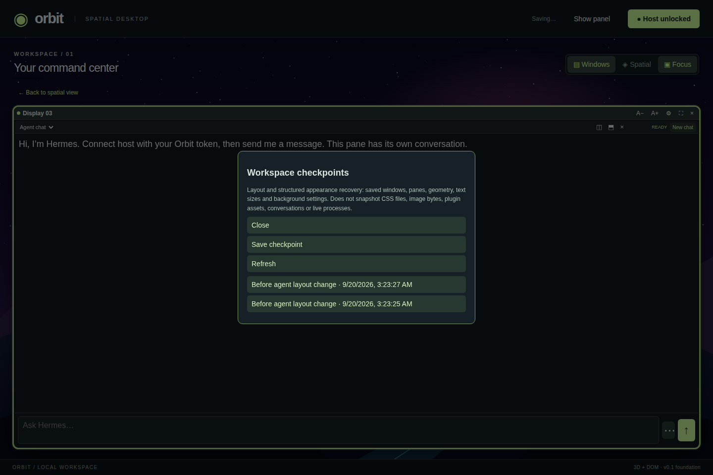

# Orbit Desktop

### A workspace you can build with your agent—not just talk to.

Orbit brings **Hermes, persistent host terminals, sandboxed app plugins, and a live customizable desktop** into one private workspace. Ask Hermes to build a tool, place it beside your work, change its configuration, or restore an earlier layout. Use familiar windows or a Three.js spatial view without changing the underlying workspace.

**Local-first · Single-owner · Agent-operated · Checkpointed customization**



> **Project status:** actively developed, working software. Sandboxed app plugins and a trusted integration registry are implemented. Orbit is **not yet a fully modular operating system**, a multi-user cloud desktop, or a general-purpose browser engine. See [what is implemented](#what-you-can-do-today) and the [roadmap](docs/ROADMAP.md).

[Quick start](#quick-start) · [Use cases](#make-it-yours) · [Plugin guide](docs/PLUGINS.md) · [Hermes operator guide](docs/AGENT_GUIDE.md) · [Security](docs/SECURITY.md)

## Make it yours

| Workflow | Ask Hermes | What Orbit provides |
| --- | --- | --- |
| Focus station | “Build a configurable focus timer beside my terminal.” | Publish a static widget, install it as a plugin, configure it and open a movable pane. |
| Project cockpit | “Arrange my shell, documentation and this chat for development.” | Targeted layout operations, pane splits, Windows/Spatial/Focus views and saved geometry. |
| Personal workspace | “Use a dark background, round the windows and hide the sidebar.” | Validated live appearance settings and checkpointed workspace changes. |
| Iterative tools | “Update this widget, but keep a way back if it breaks.” | Content-addressed bundles, plugin updates and restoration of prior entry/configuration references. |
| Long-running work | Reload the page while a shell command is running. | Unlock host access and reconnect the same pane to its tmux-backed shell. |
| Agent operations | Inspect what Hermes is doing without sending another prompt. | Real tool activity, supported live events, mid-run guidance, approvals and scheduled-task controls. |

These are workflows, not preloaded canned prompts. Hermes needs an appropriately configured API server and tool access; generated apps still need real testing.

## What you can do today

**Compose a live desktop.** Move and resize windows in flat or spatial view, split panes, change text size, hide the sidebar and focus a single display. Layout updates synchronize through revision-checked workspace operations. Structured background, wallpaper, inherited text color and corner radius changes require no frontend rebuild.

**Build tools as plugins.** Install, enable, configure, update, disable and remove sandboxed static apps. A plugin has a versioned manifest, a published entry point and primitive-valued configuration. New bundles receive content-addressed URLs so old bundles can remain available for rollback. Open **Hermes tools → Workspace plugins**, or **Ctrl+Alt+P** with the workspace focused.



**Recover deliberately.** Agent controller mutations and plugin-manager changes save a checkpoint. Restore layout, structured appearance, plugin registration, configuration and entry references. A restore saves another checkpoint first. Checkpoints do not undo external actions or snapshot arbitrary files, terminal processes or conversations.



**Keep shells through reloads.** Terminal panes connect to real host-account shells through xterm.js, node-pty and tmux. Reloading disconnects the client, not the persistent shell. Re-enter the host token and reconnect. `exit` ends the shell; closing its pane detaches it. Host reboot persistence and automatic migration of legacy shells are not provided.

**Use Hermes directly.** Separate conversations per pane, server-backed follow-up context, stop/approval controls, draft recovery, transcript export, active-run guidance, tool inspection, gateway-gated live events, skill/toolset discovery and scheduled-task listing with confirmed pause/resume. Available features depend on your Hermes gateway. [Integration details →](docs/HERMES.md)

## Quick start

### Requirements

The verified target is **Linux**, an ordinary user account, **Node.js 22.12+**, npm, Python 3, and **tmux installed at `/usr/bin/tmux`**. Node 24 has been used for live testing. Other operating systems need terminal-adapter work and are not currently verified for persistent shells.

`node-pty` is native. If a prebuilt binary is unavailable, install Python 3, make and a C++ compiler. On Debian/Ubuntu, the relevant packages include `python3`, `make`, `g++` and `tmux`.

```sh
git clone https://github.com/mojomast/orbitdesktop.git
cd orbitdesktop
npm ci
npm run build
npm start
```

Open **http://127.0.0.1:4318**. Use **Connect host**, enter the token printed by the server, then choose **Connect shell** in a terminal pane. The server stays running. Without a configured `ORBIT_TOKEN`, a new token is generated at startup.

> This grants a real shell as the server's OS user. Do not run Orbit as root or expose it to the public Internet.

### Connect Hermes

Start your Hermes API server separately. Configure its base URL and API key on the **Orbit server**, not in browser code. See [the exact environment settings and setup](docs/HERMES.md). The gateway's tools must be able to reach the Orbit repository/runtime for the local workspace controller to work.

Orbit injects its [operator guide](docs/AGENT_GUIDE.md), the active workspace ID, controller location and bounded workspace metadata into workspace-aware chat. The guide covers plugin-first development, checkpoints, safe configuration updates, terminal preservation and verification. A repository-level [AGENTS.md](AGENTS.md) also guides coding agents working on Orbit itself.

### Private remote access

Use a private authenticated network such as Tailscale Serve, with Orbit's exact public origin configured. Keep the backend on loopback. Do not use Funnel or an unauthenticated public proxy. Deployment examples are under [`deploy/`](deploy/); their absolute paths are examples from one installation and must be adapted.

## Optional Jev quick actions

Open **Hermes tools → Jev quick actions** to supply a TypeSafe key and explicitly authorize a limited workspace summary. This experimental typed-decision path previews view/sidebar changes and installed-plugin enable/disable before a checkpointed apply. Keys are not saved. Complex requests stay with Hermes. Live provider quality and speedup have not yet been measured; contract/browser tests use a synthetic provider decision. [Research, privacy and limits →](docs/JEV.md)

## Your first plugin

Publish the included notes example:

```sh
python3 scripts/plugin_publish.py examples/plugins/notes \
  --id notes --version 1.0.0 --title 'Workspace notes'
```

Copy the emitted manifest into **Workspace plugins → Plugin manifest JSON → Install disabled**, then enable it. Use **Configure** to set, for example:

```json
{"title":"My project","message":"Keep the next useful action visible."}
```

The example's scratch text is temporary; its configuration is checkpointed. Hermes can perform the same lifecycle using `scripts/workspace_control.py` and the active workspace ID. Updates do not require editing Orbit's source. [Manifest, API, publisher and rollback reference →](docs/PLUGINS.md)

Plugins run in sandboxed iframes, not in the parent application's JavaScript context. They receive no host credentials or privileged bridge. Network access is currently allowed. Published files are reachable by anyone who can reach the deployment: **never put secrets in a bundle or plugin configuration**.

## Live updates and persistence: the precise contract

| Change or data | Behavior |
| --- | --- |
| Layout / structured appearance / plugin lifecycle | Saved server-side; connected pages synchronize, normally on the next 1.2-second poll. |
| Browser closed | Changes remain saved; visual acknowledgement waits for reconnection. |
| Plugin configuration or entry update | The affected iframe may reload; its unsaved in-memory state may be lost. |
| Terminal reload | Same stable pane ID resumes its tmux shell after unlock/reconnect; not a serialized xterm scrollback snapshot. |
| Chat reload | Tab-local draft/run/conversation state plus Hermes server history; not a cross-device conversation library. |
| Checkpoint restore | Workspace metadata and plugin entry/config references, not shell side effects, emails, image bytes or app databases. |
| Built stylesheet changes | Existing pages can swap updated styles without replacing the document. |
| Orbit core JavaScript changes | Load the new frontend once in a new tab or reload. This is not arbitrary core hot replacement. |

Do not overwrite or delete old published bundle folders if checkpoints reference them. Content-addressed publication avoids overwrites through that publisher; it is not filesystem-enforced immutability or a disaster backup.

## Controls

| Action | Control |
| --- | --- |
| Move / resize | Window title bar / bottom-right corner in Windows or Spatial view |
| Focus / return | Display focus control / Back or Escape |
| Change view | Windows / Spatial toggle |
| Change text size | A−/A+ or inspector; 6–32 px |
| Split panes | Pane toolbar; drag or keyboard-adjust the divider |
| Hide settings | Side-panel toggle |
| Camera | Drag empty space or Alt-drag; scroll/Alt-scroll to zoom |
| Manage plugins | Hermes tools menu or Ctrl+Alt+P |
| Save / restore | Hermes tools → Workspace checkpoints |

Spatial diagonal sizing is relative, not calibrated physical inches; the former 55-inch ceiling is gone. Existing window/pane count and numeric validation limits still apply. Embedded sites may refuse framing or login; open them externally rather than bypassing their security headers.

## Architecture at a glance

```text
Hermes API  ← authenticated bridge →  Orbit core
                                      ├─ revisioned workspace + checkpoints
                                      ├─ trusted, lazy-loaded integration modules
                                      ├─ sandboxed app-plugin windows
                                      └─ authenticated terminal transport → tmux → host shell
```

TypeScript + Vite + Three.js/CSS3D on the client; Node.js + node-pty on the host. Trusted integration modules use a typed activation registry. User-generated apps use the separate sandboxed plugin lifecycle. Authentication, recovery, terminals and the main renderer remain core responsibilities. [Architecture and source map →](docs/ARCHITECTURE.md)

## Development and verification

```sh
npm run check                         # typecheck, build, Node tests
python3 tests/plugin-publish.test.py   # bundle reuse, version retention, symlink rejection
```

For frontend development, start the backend with:

```sh
ORBIT_DEV_ORIGINS=http://localhost:4173,http://127.0.0.1:4173 npm start
```

Run `npm run dev` in another terminal and open http://localhost:4173. Use the loopback production server for ordinary use; the Vite development server binds broadly.

Real Playwright checks under `tests/browser-*.py` exercise plugin lifecycle/rollback, terminal reloads, agent runtime controls and appearance changes. They require a configured live deployment and Playwright Chromium; they are not all run by `npm run check`. Screenshots above were captured from a separate demo browser workspace with synthetic content using [`scripts/capture_readme.py`](scripts/capture_readme.py), not from private user conversations.

## Documentation

| Guide | Purpose |
| --- | --- |
| [Hermes operator guide](docs/AGENT_GUIDE.md) | What the embedded agent should do—and avoid |
| [Workspace controller](docs/WORKSPACE_CONTROL.md) | Layout, appearance, publishing and deployment notes |
| [Plugins](docs/PLUGINS.md) | Manifest, lifecycle, configuration, security and rollback |
| [Architecture](docs/ARCHITECTURE.md) | Modules, state, rendering and transport boundaries |
| [Hermes integration](docs/HERMES.md) | Gateway configuration and direct runtime features |
| [Checkpoints](docs/CHECKPOINTS.md) | Recovery coverage and exclusions |
| [Security](docs/SECURITY.md) | Authentication and host-access risks |
| [Roadmap](docs/ROADMAP.md) | Delivered capabilities versus unfinished work |

## What's next

The next architectural steps are permission-controlled backend integrations, independent recovery boot, staged plugin validation/promotion, and further extraction of pane/scene behavior into modules. Dependency resolution, multi-user isolation, direct SSH adapters, full browser-engine sessions and reboot-persistent shells are **not implemented**. See the [roadmap](docs/ROADMAP.md) rather than treating the design proposal as shipped functionality.
