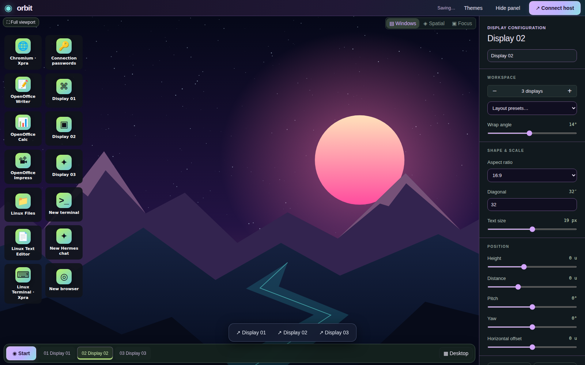
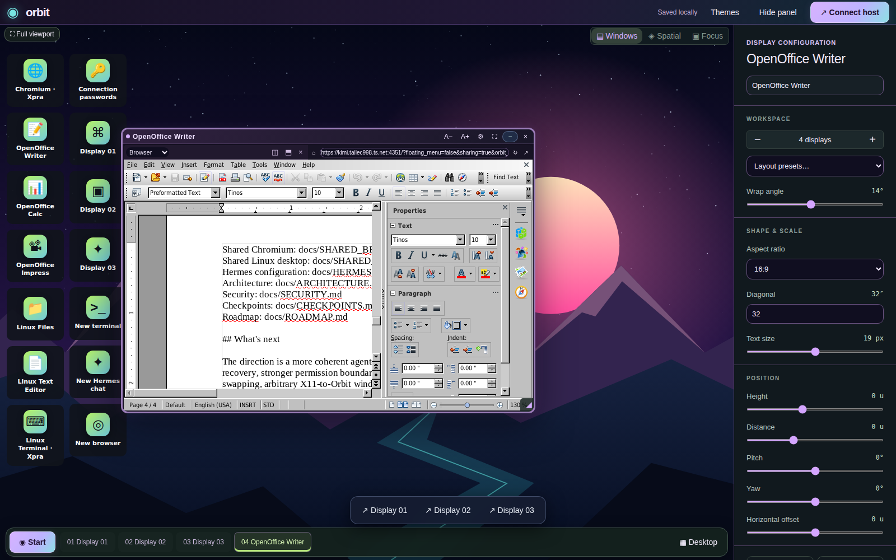
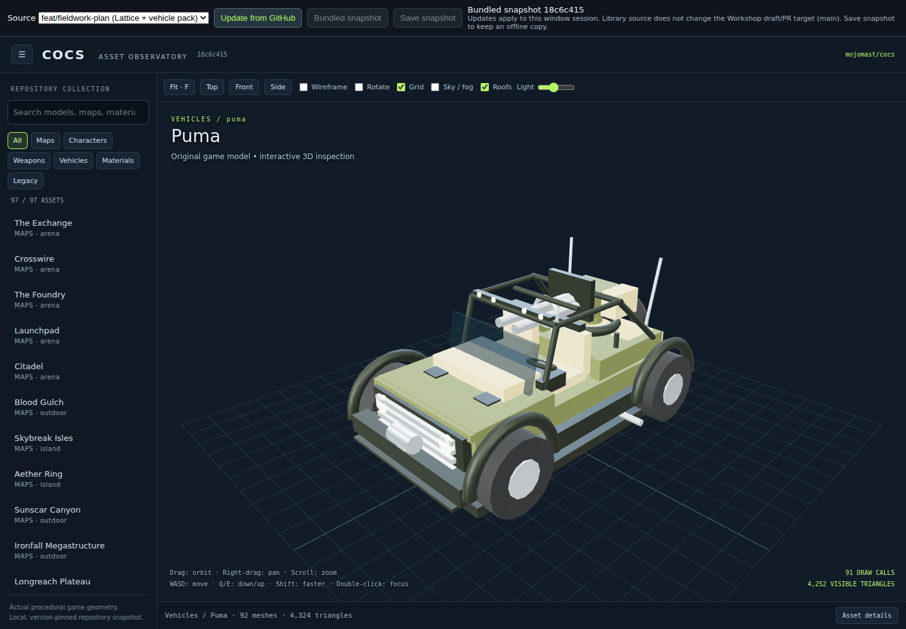
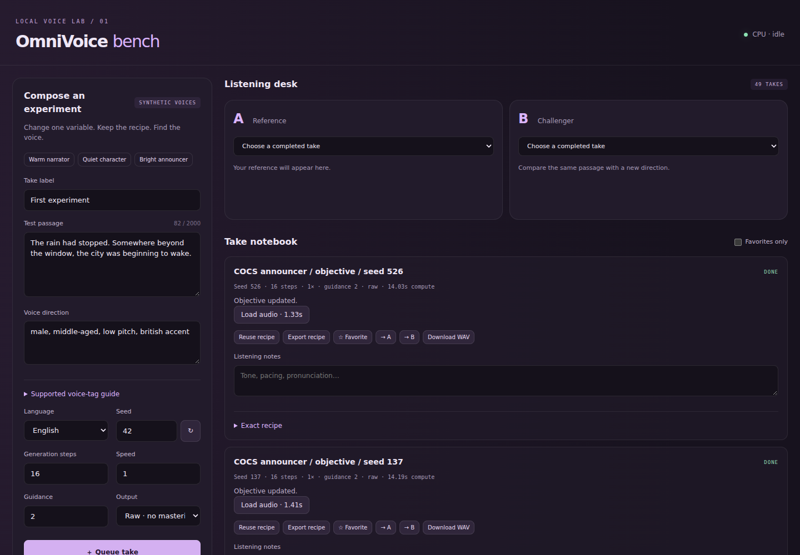
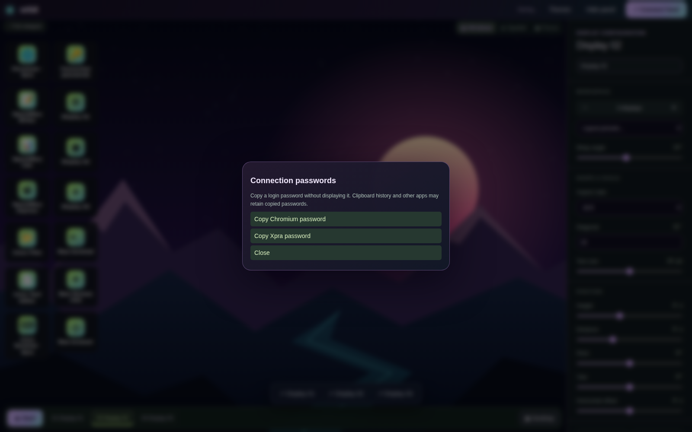

# Orbit Desktop

Your workspace. Shaped by your agent. Built around you.

Orbit is an agent-customizable browser desktop powered by Hermes. Instead of adapting your work to a fixed dashboard, describe what you need: a research station, a project cockpit, an interactive asset viewer, or a tool that does not exist yet. Your agent can build the interface, place it beside your work, and refine it with you.

Conversations, persistent host terminals, web apps, and optional Linux applications share one workspace. Start with the tools you have. Ask for the tools you wish you had. Keep changing the desktop as your needs change.

**Local-first · Single-owner · Agent-operated · Yours to shape.**

[Quick start](#quick-start) · [Agent technology guide](#agent-technology-guide) · [Example workflows](#example-requests-that-combine-the-technologies) · [Linux apps](docs/XPRA_APPS.md) · [Agent guide](docs/AGENT_GUIDE.md) · [Security](docs/SECURITY.md)

**Package version 0.3.1:** see the [release notes](docs/RELEASE_0.3.1.md) and
[Hermes plugin installation guide](hermes-plugin/README.md). Project Workbench is
experimental and off by default; enable it in Orbit settings. Optional Docking is
also off by default. Read the [deployment guide](docs/DEPLOYMENT.md) before upgrading
an existing runtime. The [evolution testing guide](docs/TESTING_BRANCH.md) records
the integration's historical development and acceptance evidence.

**Current development candidate:** the usability and technology features below
are implemented and tested on the testing deployment; they are not a newly
published release. Start with the [feature guide](docs/TECHNOLOGY_FEATURES.md)
and [example prompts](docs/WORKSPACE_PROMPTS.md). See the
[candidate verification record](docs/VERIFICATION.md) for exact-head evidence
and outstanding owner acceptance.

**Comet Project Workbench (experimental, off by default):** enable it in
**Orbit settings** (◉ orbit menu → Orbit settings) and then describe a goal,
review an editable brief and prepare a tracked task through
[guided setup](docs/WORKBENCH_SETUP.md). Preparation is separate from approving
execution. Project inspection, scoped context sharing, configured native workers,
recorded candidate checks and human review have distinct authority boundaries.
[Current capabilities and limits](docs/PROJECT_WORKBENCH.md) describe supported
profiles and configuration; a working chat connection alone does not configure
native Workbench execution. Disabling the experimental surface hides its controls
without deleting stored tasks, candidates or results.

**Choosing a layout:** [Desktop and experimental Docking](docs/RENDERER_COMPARISON.md)
arrange the same chats, terminals and apps in different ways. The default Desktop
uses movable windows; opt-in Docking adds tiled panels and tab groups. See the
[release notes](docs/RELEASE_0.3.0.md) for compatibility and known limitations.

Local loopback operation does **not** require Tailscale. Ordinary HTTP(S) hosting
and optional private tailnet access use the same application; see the
[deployment and rollback guide](docs/DEPLOYMENT.md). Deployment-specific acceptance
is documented separately from local fixture results.

## More than a chat window

Most AI interfaces end at an answer. Orbit gives the agent a workspace in which to act: create a small application, place it beside your work, configure its behavior, and help you use it. You remain in control of the files, services, credentials, and deployment.

Use familiar movable windows or switch to a spatial view. Keep an editor next to your terminal and your conversation. Desktop shortcuts bring applications back without requiring you to reconstruct the workspace.

Orbit is actively developed software, not a finished operating system or a multi-user cloud desktop. Some integrations require separate setup. The boundaries below are part of the product, not fine print.

## Agent technology guide

**What can I actually ask my agent to do?** The following guide maps Orbit's
technologies to useful tasks, example requests and the access needed to complete
them. It covers the current development candidate. Follow each linked guide for
setup and the precise supported contract.

An agent has three ways to work with Orbit:

- **Act directly:** use its configured Hermes tools, the scoped Orbit workspace
  controller, or an explicitly configured host-side helper.
- **Work on selected resources:** use a grant for specific source snapshots or an
  approved Workbench candidate. The tool's returned scope determines access.
- **Produce something for review:** generate a document, diagram, SQL query,
  interactive card or browser-action proposal that Orbit presents through the
  relevant built-in tool. The table identifies the owner action that completes it.

In **Hermes tools → Skills and tools**, inspect the connected gateway's actual
toolsets and skills. File, terminal, web-research and other upstream toolsets
depend on that profile's configuration. Installing Orbit adds the interfaces
below; it does not enable every upstream Hermes integration.

### Agent runtime, workspace and persistent tools

| Technology | What the agent can do with it | Example request | Access / setup |
| --- | --- | --- | --- |
| **Hermes gateway, profiles and skills** | Research, write code, calculate, use configured tools, and continue a conversation in a chosen runtime profile. Supported gateways also accept guidance during a run. | “Inspect this repository, explain the failing test, and fix the cause. Keep me informed as you work.” | Requires a configured Hermes API connection and the relevant upstream tools. Available skills/toolsets are discoverable in the read-only catalog. [Hermes guide](docs/HERMES.md) |
| **`orbit_workspace` — typed workspace controller** | Discover actual capabilities, read window/pane identities, preview a batch, open tools, arrange panes, customize appearance and inspect operation history. | “Put my existing terminal, our conversation and the document library side by side. Preserve their identities and other windows.” | Explicit workspace binding; read-only by default. Changes require `allow_mutations`. [Controller](docs/WORKSPACE_CONTROL.md), [adapter setup](hermes-plugin/README.md) |
| **Three.js / CSS3D spatial desktop** | Arrange real HTML panes in a spatial scene; adjust supported placement, depth, rotation, arc and appearance through validated workspace operations. | “Make a curved research workspace with the sources on the left and the plan in the center.” | Uses the existing workspace controller and measured workspace state. Embedded controls remain normal DOM/iframes. [Architecture](docs/ARCHITECTURE.md), [operations](docs/WORKSPACE_OPERATIONS.generated.md) |
| **Dockview, saved layouts and arrangement recipes** | Help organize tiled panels/tab groups, preview reusable role-based arrangements and recover a prior arrangement without inventing new resource identities. | “Prepare a Review arrangement around this project's candidate diff, checks and conversation; keep my other work available.” | Docking is opt-in. Saved layouts store placement; controller arrangement recipes resolve existing project/pane roles. [Renderers](docs/RENDERER_COMPARISON.md), [saved layouts](docs/SAVED_WORKSPACE_LAYOUTS.md), [recipes](docs/WORKSPACE_ARRANGEMENTS_API.md) |
| **xterm.js + node-pty + tmux** | Open persistent host terminal panes and, with configured Hermes terminal tools, run builds, scripts and diagnostics on the authorized host. | “Run the project tests and leave a terminal beside the code discussion so I can inspect the output.” | A terminal pane and an agent's shell tool have separate identities/access. tmux survives browser detach/reload, not host reboot. [Managed terminals](docs/MANAGED_TERMINALS.md) |
| **Conversation library and host-backed drafts** | Continue work in the selected Hermes session; help locate prior conversations by title/ID and prepare follow-up text. | “Help me resume ‘Release research’ without losing this draft.” | Owner selects the bound conversation. Library search covers titles/IDs, not all transcript contents. [Conversation library](docs/CONVERSATION_LIBRARY.md) |
| **Context handoffs and Outputs** | Publish public app/report files and prepare precise references, citations or selected result values for a chosen conversation. | “Open Outputs beside chat and help me include the report reference and these exact result rows in my next question.” | Owner reviews insertion into one draft; insertion never sends. Output aliases/pins/tags use the owner library. [Outputs](docs/OUTPUT_LIBRARY.md), [handoffs](docs/CONTEXT_HANDOFF.md) |
| **Hermes scheduled tasks** | Help compose a recurring job's prompt, schedule and delivery instructions; configured upstream scheduling tools may manage jobs directly. | “Prepare a weekday test-summary task for this project, with a concise report and a clear failure condition.” | Orbit's Scheduled tasks UI manages real gateway jobs with explicit confirmation. Agent-side scheduling depends on the upstream toolset. [Scheduling](docs/HERMES.md#scheduled-tasks) |

### Research, calculations and editable artifacts

| Technology | What the agent can do with it | Example request | Access / setup |
| --- | --- | --- | --- |
| **SQLite FTS5 + sqlite-vec + MiniLM** | Search granted snapshots by keyword and compare exact cited passages. The owner search surface also supports local hybrid semantic retrieval and sharing its passages with the agent. | “Find the budget and delivery constraints in these sources, and distinguish binding requirements from informal estimates.” | Owner imports snapshots. Delegated search is keyword-only; hybrid search in the owner surface needs the pinned local MiniLM model. Citations bind exact bytes and text ranges. [Knowledge search](docs/KNOWLEDGE_SEARCH.md) |
| **`orbit_resources` — scoped source research and brief creation** | Search/read the granted sources and create a **new, saved, cited, editable document**. Then use workspace control to open its returned URI. | “Use the sources granted to this run to create a cited decision brief. Explain disagreements and open the saved brief beside our chat.” | Requires the configured pinned local Normal adapter or supported dedicated channel. Normal grants bind the selected conversation's **next accepted run**; another run needs a fresh grant. [Resource delegation](docs/RESOURCE_DELEGATION.md) |
| **DuckDB-Wasm — Data workbench** | Propose bounded SQL over shared CSV/JSON/Parquet schemas, interpret explicitly shared result rows and help prepare reproducible exact-input recipes. | “Using the schema I shared, write a SELECT for monthly revenue and explain outliers in the result rows I send back.” | SQL proposals fill the editor; the owner runs the query. Input files stay in the browser engine until explicitly shared. JSON/Parquet need provisioned extensions. [Data Lab](docs/DATA_LAB.md) |
| **Hash-pinned published CSV inputs** | Publish public/synthetic data and open the exact CSV in the existing Data workbench without a file picker. | “Publish this synthetic manifest, open it with its SHA-256, and prepare a query that totals cost by supplier.” | Strict same-origin immutable CSV route, up to 5 MiB; hash verification precedes loading `input_1`. Query execution remains explicit. [Published-input contract](docs/DATA_LAB.md) |
| **Lexical — rich-text documents** | Author text/Markdown/editor-state deliverables and revision-bound whole-document proposals; help refine a brief while preserving concurrent owner edits. | “Turn this shared outline into a project brief. Propose changes against the current document revision and draft digest.” | Complete-result/import proposals create or change an editable draft for owner review, Undo and Save. Delegated **new** document creation uses `orbit_resources`; existing-document editing uses the reviewed proposal path. [Documents](docs/DOCUMENTS.md) |
| **Excalidraw — editable diagrams and whiteboards** | Produce supported scene JSON for architecture diagrams, deployment plans and visual explanations that remain editable. | “Create an editable diagram of these services, with arrows for data flow and labels for trust boundaries.” | Use the canvas contract and supported fonts; owner reviews/imports and saves the scene. The agent needs explicitly shared source content. [Canvas](docs/CANVAS.md) |
| **A2UI v0.9 / official Lit renderer** | Generate structured comparison cards, choices, checkboxes, sliders, text fields and notes; compatible complete replies offer an explicit result-delivery action. | “Make an editable three-option comparison with cost, risks, a choice field and decision notes.” | Reviewed JSON/NDJSON catalog; choose a mounted results pane, review and save. Its finite summary action prepares a draft. Input bindings alone do not implement domain calculations or execute arbitrary tools. [Interactive results](docs/INTERACTIVE_RESULTS.md) |
| **Transformers.js + ONNX Runtime WASM + Moonshine** | Work from a locally transcribed voice request after you review and submit the text. | “Open Voice transcript so I can dictate a revised requirement; once I send it, update your proposed plan.” | Explicit microphone/audio selection; separately provisioned Moonshine model. Transcription runs in a browser worker. Review/edit and draft insertion precede Send. [Voice dictation](docs/VOICE_DICTATION.md) |
| **Asteria shared scenario model / interactive simulator** | Build a domain-specific tool in which controls, comparisons, constraint checks and exported briefs use the same deterministic calculation model. | “Build a simulator where changing the budget, upgrades or relay timing updates the actual mission tradeoffs and exported brief.” | Working source example, separately published as a sandboxed plugin. Its bundled data is synthetic; scenario edits are page-local and exports are explicit downloads. [Asteria Mission Control](docs/ASTERIA_MISSION_CONTROL.md) |

### Browser, desktop and application integration

| Technology | What the agent can do with it | Example request | Access / setup |
| --- | --- | --- | --- |
| **Playwright / Browser copilot** | Prepare finite browser actions and reason over an explicitly shared observation from a disposable Chromium session. | “Help me inspect this allowed page and stage a click on its documentation link after reviewing the snapshot.” | Requires a configured Chromium executable and origin policy. Owner Preview/Execute controls each action; the session is signed out. This surface is separate from upstream Hermes browser tools. [Browser copilot](docs/BROWSER_COPILOT.md) |
| **Shared Chromium / Chrome DevTools Protocol** | Navigate, inspect text, click, fill, press keys and take screenshots in the same separately configured browser the owner views. | “Open the project documentation in our shared browser and show me the section that describes configuration.” | Dedicated Docker browser profile and host-side `scripts/shared_browser.py`; shared focus/session needs coordination. [Shared Chromium](docs/SHARED_BROWSER.md) |
| **Shared Linux desktop / XFCE / X11** | Inspect windows, capture screenshots, launch supported applications and interact through clicks/keys/text with the host-side desktop helper. | “Open the editor in our shared Linux desktop and walk me through this configuration file.” | Separately provisioned container/viewer and `scripts/shared_desktop.py`; distinct from the host desktop and Shared Chromium. [Shared desktop](docs/SHARED_DESKTOP.md) |
| **Xpra HTML5 / native Linux applications** | Open configured Chromium, OpenOffice Writer/Calc/Impress, file manager, editor and terminal viewers alongside the conversation; prepare files for those apps using authorized file tools. | “Prepare a CSV and document outline for the shared Documents folder, then open Calc and Writer beside chat.” | Optional per-app containers, persistent homes and shared Documents volume. Xpra provides the viewer; GUI automation needs separately configured controls. [Linux apps](docs/XPRA_APPS.md) |
| **MCP Apps / `@modelcontextprotocol/ext-apps` AppBridge** | Author a self-contained SDK-compatible report/visualization snapshot with exact arguments and results for Orbit to display. | “Prepare an MCP App snapshot with local controls for exploring this supplied report result.” | Requires MCP Apps configuration and a separate sandbox origin. Owner stages/imports/opens the snapshot. This integration hosts snapshots; live MCP tool/server access comes from separately configured upstream tools. [MCP Apps](docs/MCP_APPS.md) |

### Custom software, supervised coding and diagnostics

| Technology | What the agent can do with it | Example request | Access / setup |
| --- | --- | --- | --- |
| **HTML/CSS/JavaScript sandboxed plugins** | Build calculators, visualizers, timers and task-specific interfaces; publish content-addressed versions, install/configure them and retain older bundles. | “Build a project-specific asset viewer, test its controls, and put it beside my terminal.” | Host file/terminal tools build and publish; scoped workspace operations install/enable/update. Generated frames have no owner-token or private host bridge. [Plugin lifecycle](docs/PLUGINS.md) |
| **Typed widget configuration and independent instances** | Give a widget validated settings and create independent configured instances without copying its implementation. | “Give this timer a duration setting and create separate 25-minute writing and 10-minute review instances.” | Author-declared schema, validated lifecycle/configuration operations; definition updates affect its instances. [Widget configuration](docs/WIDGET_CONFIGURATION.md) |
| **GitHub-pinned plugin catalog** | Prepare a reviewed catalog submission or help install/update an admitted app pinned to an exact upstream commit. | “Package this tested widget for the catalog and document its configuration and update procedure.” | Catalog admission requires maintainer review; sync/publication and local activation are separate. [Catalog guide](plugin-catalog/README.md) |
| **Trusted Python backend extensions** | Stage, health-check, activate, inspect logs, restart or roll back a separately authorized host service using the extension runner. | “Build a local service for this dashboard, stage it for review, and verify health before promoting the new version.” | Explicit trusted host-code activation and a separate loopback port. Backend-connected catalog apps have their own connection/setup flow. [Extensions](docs/EXTENSIONS.md), [catalog backends](docs/CATALOG_BACKENDS.md) |
| **Extension Studio — finite focus-timer generator** | Help choose the timer's public title, duration and accent, then guide the exact-artifact preview/install workflow. | “Help me create and preview a 25-minute focus timer in Extension Studio.” | Owner-operated built-in generator; no general Hermes-authored code admission through Studio. For arbitrary apps, use the plugin publisher above. [Extension Studio](docs/EXTENSION_STUDIO.md) |
| **Project Workbench / `orbit_workbench` / Git candidates** | Propose a task brief in Normal chat; an approved native worker can inspect and modify its private candidate, request supported checks and produce a reviewable result. | “Prepare a task to fix this failing Node test. Define success, work on the approved candidate, and present the exact diff and check evidence.” | Experimental, off by default; separate registered project, native worker configuration and attempt grant. Candidate checks and human review remain distinct. Supported profiles include locked Node/TypeScript test projects. [Guided setup](docs/WORKBENCH_SETUP.md), [Workbench](docs/PROJECT_WORKBENCH.md) |
| **gVisor / runsc isolated checks** | Have an approved candidate's supported Node test run checked in an offline rootless sandbox, when the host supports it. | “Use the configured isolated Node-test backend to verify this candidate and show its recorded result.” | Experimental; separately provisioned runsc/rootfs and working rootless namespaces. It isolates the check job, not the entire Hermes agent or dependency preparation. [Isolated checks](docs/ISOLATED_CHECKS.md) |
| **Private project notebooks and evidence cards** | Prepare notes from shared project context and help interpret the project's recorded checks/review facts. | “Help me summarize this investigation in a project notebook and explain the recorded evidence card.” | Owner-operated finite Workbench tools with independent private storage; not a generic agent content API. [Project tools](docs/PROJECT_TOOLS.md) |
| **OpenTelemetry / local Run traces / live activity** | Help diagnose time spent in observed runs and tools using an explicitly shared redacted timing summary; produce widgets that consume the existing sanitized tool-event feed. | “Explain which observed tool calls dominated this run, and distinguish missing events from confirmed completion.” | Trace summaries are shared deliberately. Owner live/saved tool details may contain richer private content; traces and plugin feeds carry narrower observations. [Run traces](docs/RUN_TRACES.md), [inline tool activity](docs/INLINE_TOOLS.md), [plugin event feed](docs/PLUGINS.md) |
| **SQLite workspace store, receipts and checkpoints** | Preview changes, record/recover exact operation outcomes, compare checkpoints and restore a requested workspace layout/plugin state. | “Checkpoint this layout before rearranging it. If I ask to go back, compare the changes and restore that checkpoint.” | Revision-checked controller operations; document/source/conversation stores and external effects have separate lifecycles. [Workspace store](docs/WORKSPACE_STORE.md), [checkpoints](docs/CHECKPOINTS.md) |
| **Jev / TypeSafe quick actions** | Offer a separate owner-enabled fast path for a small set of workspace view/sidebar and installed-plugin enable/disable actions. | In Jev quick actions: “Hide the sidebar and switch to Spatial view.” | Experimental external service requiring its own configuration and consent. Normal Hermes tool calls continue to use their existing path. [Jev](docs/JEV.md) |

### The supporting software stack

Orbit's host is **Node.js** with a **TypeScript/JavaScript** frontend built by
**Vite**; **Python** supplies the Hermes adapter and operator helpers. **React**
supports the Excalidraw integration, while **Lit** renders the reviewed
A2UI catalog. **better-sqlite3/SQLite** backs durable host records; **WebSockets**
carry terminal traffic and **SSE** carries supported agent activity. Validation
uses closed contracts and libraries including **AJV** and **Zod**; code/diff views
use **highlight.js** and **diff**. These libraries support the capabilities above,
rather than each creating an independently callable agent tool.

Agents working on authorized Orbit source can use the repository's **Node test
runner, Python tests and Playwright/Chromium browser fixtures** to verify changes.
For example: “Implement this control, run its relevant tests, and demonstrate its
actual interaction in an isolated browser workspace.” See
[verification](docs/VERIFICATION.md), [architecture](docs/ARCHITECTURE.md),
[direct dependencies](package.json) and [third-party versions/notices](docs/THIRD_PARTY.md).
Optional **Docker**, **Xpra**, reverse proxies and **Tailscale** supply deployment
and remote-access plumbing where configured; ordinary local operation also works.

### Example requests that combine the technologies

**A cited research brief — source search + scoped resources + Lexical + workspace control**

> “Use the sources granted to this run to compare the proposals. Cite the exact
> passages, identify disagreements, create a new saved editable brief, and open
> its returned document beside our conversation.”

Select/import the sources and grant the intended conversation's next run first.
The agent can then read repeatedly and create the brief within that scope.

**A reproducible analysis — published CSV + DuckDB + reviewed result sharing**

> “Publish this synthetic CSV and open it in Data workbench with its hash. Propose
> a supplier-cost query. After I run it and share the selected rows, explain the
> concentration risks and prepare a comparison card.”

The published route handles input loading; explicit query execution and selected
result sharing connect the browser's analysis to the agent's reasoning.

**An interactive decision tool — JavaScript model + plugin lifecycle + browser tests**

> “Build an Asteria-style simulator for this public demonstration dataset. Bind
> every displayed metric and exported brief to the same scenario. Make changed
> assumptions recalculate the result, and test the actual controls.”

[Asteria Mission Control](docs/ASTERIA_MISSION_CONTROL.md) is the working source
example: both reliability upgrades produce **$2,137,000** equipment cost and
approximately **91.12%** modeled reliability. Cutting the original budget by 15%
sets a **$1,700,000** cap and exposes a **$437,000** gap. Its evidence viewer and
exports use the same source/model identities; unresolved engineering evidence
stays visible.

**A supervised code change — Hermes + Workbench + candidate checks + review**

> “Prepare a bounded repair task for this registered project. After I approve the
> candidate and execution, fix the failure, request the supported checks, explain
> the exact changes and prepare the reviewed patch for transfer.”

Workbench retains candidate/check/review identities. The owner reviews the result
and explicitly exports/transfers it; its private candidate is separate from the
original working tree. More ready-to-adapt examples:
[workspace prompts](docs/WORKSPACE_PROMPTS.md).

## What you can do

### Launch real Linux applications

The optional Xpra integration provides desktop shortcuts for Chromium, Apache OpenOffice Writer, Calc and Impress, a file manager, a text editor, and a Linux terminal. Each application opens in a movable, resizable Orbit window.

These are native Linux programs running in containers, displayed through Xpra's HTML5 client—not applications compiled to WebAssembly and not VNC streams. Each launcher has its own Xpra session. Application menus and dialogs remain inside that application's viewer; Orbit does not yet map every X11 child window to a separate desktop window.

The apps have separate persistent home directories and a shared Documents volume. Closing the Orbit viewer does not quit the Linux application. Reopening reconnects; quitting inside the app ends the application. A host reboot loses running application state, while named-volume files persist.

Setup and limitations: [per-app launchers](docs/XPRA_APPS.md) and [Xpra deployment](docs/XPRA.md).

### Work with Hermes where the work happens

Use separate conversations in separate panes. Inspect tool activity, guide an active run, respond to approvals, and use supported scheduling controls. Available features depend on the configured Hermes gateway. Chat messages, guidance, and saved drafts support up to 100,000 characters. Optional browser desktop notifications announce agent replies without including conversation content; permission is required, Orbit must remain open, and browser/OS restrictions apply.

Ask for concrete changes: “Build a timer beside my editor,” “Arrange my research workspace,” or “Change this widget without losing its old version.” Hermes receives the active workspace context and an operator guide for scoped, revision-checked changes.

### Keep your shells alive through reloads

Host terminals use tmux-backed sessions identified by stable pane IDs. Reload Orbit, unlock host access, and reconnect to the same shell. Closing a pane detaches its shell; typing exit ends it. Running processes do not survive host reboot automatically.

The Xpra Linux Terminal is different: it runs inside its application container, not as a host shell.

### Build small tools as sandboxed plugins

Publish static HTML, CSS, and JavaScript as versioned app plugins. Install disabled, test, enable, configure, update, and roll back entry references through workspace checkpoints. Content-addressed bundles keep older versions available when their files are retained.

Plugins run in sandboxed iframes. They do not receive host credentials or a privileged host bridge. Do not include secrets, private documents, or personal reports in publicly served bundles or URL-fragment configuration.

### Shape the desktop around your work

Desktop icons open existing windows, restore minimized applications, and launch configured integrations. The Desktop control reveals shortcuts without closing running applications. The old eight-window cap has been removed; resource constraints and other validation limits still apply.

Move, resize, split, reorder, and arrange windows. Adjust supported colors, wallpaper, corners, spacing, and chrome. Full viewport hides surrounding controls; it is not browser fullscreen. Core frontend changes still require loading the updated frontend once.

The current usability development branch adds a searchable command palette,
pinnable Outputs and Activity panels, typed plugin settings, a normal-workspace
arranger and checkpoint comparisons. These build on the existing workspace
operations; Project Workbench remains experimental and off by default. See
[workspace usability](docs/WORKSPACE_USABILITY.md) for scope and compatibility.

The current development candidate includes [reusable saved layouts](docs/SAVED_WORKSPACE_LAYOUTS.md),
a [conversation library with host-backed drafts](docs/CONVERSATION_LIBRARY.md), independent stateless widget instances,
[author-declared configuration forms](docs/WIDGET_CONFIGURATION.md), a
[searchable output library](docs/OUTPUT_LIBRARY.md), and explicit
[context handoffs](docs/CONTEXT_HANDOFF.md) into a chosen conversation draft.
Context insertion does not send a message. The extended widget records use a
schema-12 writer fence; see [store compatibility](docs/WORKSPACE_STORE.md) before
upgrading an existing runtime.

### Work with local sources, data and documents

Open these tools from **Start** or the command palette:

- **Knowledge search:** import explicit source snapshots, search them locally and
  send an exact cited passage to a selected conversation draft. Keyword search
  works immediately; semantic search needs the provisioned local model.
- **Interactive results:** import A2UI v0.9 cards, edit, save, pin and export them.
- **Voice transcript:** record or choose audio, transcribe with the provisioned
  local model, edit the text and insert it into a draft.
- **Data workbench:** query chosen CSV/JSON/Parquet files locally with DuckDB;
  save recipes and export bounded results. JSON/Parquet require local extensions.
- **Document library:** create rich-text documents and Excalidraw whiteboards,
  explicitly save revisions, recover drafts and export your work.
- **Run traces:** inspect timing for events Orbit actually observed and explicitly
  export the redacted projection.

Optional **Browser copilot** uses a configured disposable browser with reviewed
owner actions; **MCP Apps** hosts imported self-contained snapshots on a separate
sandbox origin. Neither automatically discovers Hermes tools or runs an agent
planner. Experimental **gVisor isolated checks** require a suitable separately
provisioned host. Setup, persistence and capability boundaries are in the
[technology guide](docs/TECHNOLOGY_FEATURES.md).

The [agency evolution](docs/AGENCY_EVOLUTION.md) connects these existing tools:
one exact draft review carries citations and selected data values; complete replies
can offer explicit interactive-card, document and MCP snapshot actions. Documents
support reviewed imports, digest-bound edit proposals, native Undo and discoverable
same-tab recovery after closing a dirty pane. Opening tools preserves Spatial view.
Selected-source grants use the supported authenticated recipient channels described
in [Resource delegation](docs/RESOURCE_DELEGATION.md); opening a surface alone does
not let an agent read its private contents.

**Project Workbench → Workspace arrangements** previews a named, semantic diff
before changing the desktop. Save a portable Debug recipe, resolve its roles
against another project's existing panes, and reuse it after reload or server
restart. Exact proposals and operation receipts are durable; a newer owner edit
makes an old preview stale, and Undo refuses to overwrite intervening work.
Workbench's Changes tab keeps these controls in a compact disclosure below review.
Recipes save role order and measured grid intent, not arbitrary application data
or a full geometry snapshot. Existing browser-local layouts can be imported as
role order with explicit omissions while retaining the originals. See
[arrangement contracts and limits](docs/WORKSPACE_ARRANGEMENTS_API.md).

### Recover workspace changes deliberately

Revision-checked controller mutations and supported plugin changes create checkpoints. Restore layout, appearance, plugin registrations, configuration, and entry references.

The Workspace checkpoints dialog compares a selected checkpoint with the current
layout before restoring it. A changed revision requires a fresh comparison; the
preview does not render embedded applications or roll back external effects.

The independent [`/recovery` console](docs/RECOVERY.md) also offers an owner-only,
persistent registered-plugin activation hold. Layout restore cannot release it;
release does not automatically re-enable apps. It does not stop running backends,
disconnected frames, cached offline pages or public app URLs. See
[workspace store operations](docs/WORKSPACE_STORE.md) before upgrading an existing
runtime: SQLite schema upgrades and legacy JSON migration require planned writer
coordination, not a live mixed-version restart.

Checkpoints are not filesystem backups. They do not restore documents, shell processes, conversations, container state, emails, or other external effects.

## Hermes plugin integration

Orbit includes a native Hermes agent plugin in [`hermes-plugin/`](hermes-plugin/README.md). Its ordinary `orbit_workspace` tool provides scoped workspace reads, contract-derived discovery, durable project arrangements, setup suggestions, previews, revision-checked edits, history, checkpoints and confirmed restores. It defaults to read-only and requires an explicitly configured local workspace; no credentials are pasted into chat and no services start automatically.

Two additional interfaces are available with their specific configuration:
`orbit_resources` for granted source research/new saved cited briefs, and
`orbit_workbench` for approved attempt-scoped native workers. An approved worker
gets its candidate interface instead of the ordinary workspace controller. See
the [agent technology guide](#agent-technology-guide) for concrete examples and
the access required by each workflow.

The Hermes catalog submission is pending review. The plugin now bundles Orbit's reviewed source and an explicit setup/start CLI: no separate repository clone is needed. See the [activation guide](hermes-plugin/README.md) for installation, two-command setup/start, prerequisites and trust boundaries. Orbit opens in a browser, not inside the Hermes Desktop Electron renderer. Xpra and its Linux desktop shortcuts remain optionally provisioned integrations; their source and deployment instructions are included.

## Everyday workflows

Writing and research: open Writer and Chromium beside Hermes. Develop an outline, check sources, and save the document to the Linux apps' shared Documents folder.

Software development: combine persistent host terminals, project documentation, agent conversations, and a custom status widget. Rearrange panes without recreating terminal IDs.

Personal tools: ask Hermes to build a focused timer, notes panel, calculator, or project dashboard. Test the published app before enabling it and keep an older bundle for recovery.

Linux applications from a browser: use the Xpra launchers for documents, spreadsheets, presentations, and files. Reconnect to applications after closing their viewer without starting a whole remote desktop session.

Shared visual work: use the separately configured Shared Chromium or shared Linux desktop when a common browser or complete desktop is useful. These are distinct sessions from the per-app Xpra launchers, with different storage and control paths.

## From a request to a working workspace

> “Make a workspace for this project. Keep my shell beside our conversation, build a tool for reviewing the assets, and give me a way to compare voice takes.”

Orbit gives Hermes concrete ways to act on that request:

1. **Arrange what is already there.** Move and resize windows, split panes, adjust supported appearance settings, and preserve existing terminal IDs.
2. **Build what is missing.** Create a focused HTML/CSS/JavaScript app, publish a versioned bundle, test it, and enable it as a sandboxed workspace plugin.
3. **Iterate together.** Change configuration, refine the interface, publish a new version, or reshape the surrounding desktop as the workflow develops.
4. **Recover deliberately.** Preview supported workspace changes and restore layout/plugin settings from checkpoints when needed. Files and external actions require their own recovery strategy.

This is customization through real code and scoped controls—not a promise that arbitrary backend changes hot-swap safely. Built-in layout and plugin operations can apply live; new core features need source changes, tests, a build, and an updated frontend load. Services need separate setup and explicit trust.

## Examples: tools built around a real project

These are examples of what an agent can build with you, not a catalog of local tools bundled with Orbit. Both were developed for a game-production workflow and run as separately configured applications. The screenshots show the actual interfaces, not mockups.

### “Let me explore the assets in my game repository”

The COCS Asset Observatory turns a project's procedural geometry into an interactive 3D library. Browse maps, characters, weapons, vehicles, and materials; inspect a model with orbit/pan/zoom, change viewing controls, and see geometry statistics. Repository updates and saved snapshots support review beyond a static image.

The broader lesson: ask for a viewer that understands your project's data rather than forcing that data into a generic dashboard. The project-specific models and service are not installed by Orbit's quick start.

### “Build me a voice experiment bench”

The OmniVoice app organizes a voice-production workflow around editable text and direction, generation settings and seeds, a take queue, an A/B listening desk, and reusable recipes. Completed takes retain their settings and offer WAV downloads, making it easier to compare variations and return to a promising result.

This example uses a separately configured voice backend. Orbit itself does not bundle the voice model or promise generation speed or exact seed reproducibility. The same pattern can support an analysis workbench, a review queue, or a purpose-built editor: describe the job, build a small tool, test it, and refine it together.

## Community plugin catalog

Orbit's GitHub-backed catalog accepts sandboxed static apps through maintainer-reviewed pull requests. Each app is pinned to an exact upstream commit; updates require another reviewed PR. CI validates metadata and pinned bundles without executing third-party code. The Plugin Manager shows synced catalog entries and supports disabled-first installation and explicit updates.

Read the [submission guide and admission policy](plugin-catalog/README.md). Refresh approved entries with `python3 scripts/orbit_catalog.py sync`, then rebuild/deploy the static frontend. Merge admits a listing upstream; existing desktops pick it up at their next operator sync. The initial public catalog is intentionally empty, separate from local/private tools. GitHub branch-protection settings must enforce the documented review gate.

## Quick start

The verified target is Linux with an ordinary user account, Node.js 22.12 or newer, npm, Python 3, and tmux at /usr/bin/tmux. Native node-pty builds may also require make and a C++ compiler.

For a development instance, clone https://github.com/mojomast/orbitdesktop.git,
enter the repository, then run:

    npm ci
    npm run dev

In a second terminal, start the API with the development origins explicitly allowed:

    ORBIT_DEV_ORIGINS=http://127.0.0.1:4173,http://localhost:4173 npm start

Open http://127.0.0.1:4173. Choose Connect host, enter the server's host-access token,
and connect a shell. Without a configured ORBIT_TOKEN, the server generates a token
on startup and stores it in the private runtime's `session-token` file.

`npm run build` and `npm run check` build into a separate scratch directory and
report its path; they do not replace a served checkout's `dist/`. For a served
release, use the explicit packaging, activation and compatible-backup procedure
in [deployment documentation](docs/DEPLOYMENT.md).

Host access grants a real shell as the server's operating-system user. Do not run Orbit as root or expose it directly to the public Internet.

Start the Hermes API server separately and configure its base URL and API key on the Orbit server. See docs/HERMES.md. The agent's tools need access to the repository and runtime for local workspace control.

The base setup does not automatically provision Xpra, OpenOffice, Shared Chromium, or the shared Linux desktop. Follow their deployment guides separately. The current Xpra app deployment requires Docker and uses private Tailscale HTTPS endpoints; adapt installation-specific paths and settings rather than copying credentials or private hostnames.

## Launching and reconnecting to Linux apps

After Xpra services are configured and the current frontend is loaded, reveal the desktop and select an application shortcut. Authenticate when the Xpra viewer asks.

On deployments with the Connection passwords integration, unlock Orbit host access and use Copy Xpra password. Passwords should not be placed in workspace URLs, screenshots, app bundles, or documentation. Clipboard managers may retain copied credentials.

Save shared work in Documents. The Xpra Documents volume is separate from the existing VNC desktop's files. Closing a viewer is not the same as quitting the application, and a workspace checkpoint does not back up your document.

## Security and honest boundaries

Orbit is a powerful single-owner workspace, not an isolation boundary between mutually untrusted users. Keep the server on loopback and use private authenticated remote access. Do not expose Docker, X11, VNC, or browser-debugging sockets publicly.

The current per-app Xpra setup disables clipboard synchronization, file transfer, audio, webcam, printing, and arbitrary client-requested command launching. Each app runs as a non-root user in a restricted container. Network egress remains enabled, and shared documents are accessible to the apps that mount that volume.

The Xpra Chromium launcher currently requires --no-sandbox under the deployed container policy. Its internal Chromium sandbox is therefore not a security boundary. Do not treat it as a high-security browser or store sensitive browsing credentials there. Its profile is separate from Shared Chromium.

Shared Chromium and the full shared Linux desktop remain separate integrations; adding Xpra does not silently migrate or replace them. Remote-app rendering is not browser-local execution. Container restart policies are not guarantees that unsaved application state survives a reboot.

## Architecture

The browser frontend uses TypeScript, Vite, and Three.js/CSS3D. The Node.js server provides authenticated host access, workspace state, and integration routes. Hermes supplies the agent runtime through its API bridge.

Workspace operations manage revisioned layout and checkpoints. Sandboxed plugins supply static tools. Host terminals connect through node-pty and tmux. Optional Xpra services deliver containerized Linux applications through separate authenticated browser viewers.

Generated plugins are not trusted backend extensions. Host services and core changes require explicit trust, source review, testing, and deployment.

## Development and verification

Run npm run check for typechecking, the production build, and Node tests. Run python3 tests/plugin-publish.test.py for publisher checks.

Live browser tests under tests/ exercise integrations separately and require a configured deployment. Passing a build alone does not prove an app rendered or that a live browser applied a workspace mutation. Verify real interaction, reconnect behavior, and saved results before reporting success.

Preserve the owner's uncommitted changes, existing pane IDs, running sessions, and older plugin bundles. Never commit .runtime, tokens, transcripts, or private screenshots.

The desktop, Writer, and connection-control screenshots were captured in an isolated browser workspace using `scripts/capture_xpra_readme.py`. The COCS and OmniVoice examples were freshly captured from the running applications in separate headless browser contexts for this documentation release. They show the game asset library and announcer-take workflow, not the owner's desktop or conversations. No generation jobs, source updates, or live workspace rearrangements were performed for these captures. Project-specific applications shown here are examples, not dependencies or bundled local services.

## Documentation map

Agent operations: docs/AGENT_GUIDE.md
Feature prompts and workflows: docs/WORKSPACE_PROMPTS.md
Workspace usability: docs/WORKSPACE_USABILITY.md
Local technology features and setup: docs/TECHNOLOGY_FEATURES.md
Candidate verification: docs/VERIFICATION.md
Workspace controller: docs/WORKSPACE_CONTROL.md
Plugin lifecycle: docs/PLUGINS.md
Linux app launchers: docs/XPRA_APPS.md
Xpra pilot and deployment: docs/XPRA.md
Shared Chromium: docs/SHARED_BROWSER.md
Shared Linux desktop: docs/SHARED_DESKTOP.md
Hermes configuration: docs/HERMES.md
Architecture: docs/ARCHITECTURE.md
Security: docs/SECURITY.md
Checkpoints: docs/CHECKPOINTS.md
Roadmap: docs/ROADMAP.md

## What's next

The direction is a more coherent agent-operated desktop: better application integration, clearer persistence and recovery, stronger permission boundaries, and easier deployment. Full multi-user isolation, universal backend hot-swapping, arbitrary X11-to-Orbit window mapping, and reboot-persistent running shells are not promised as shipped features.

Build the workspace you need. Keep the ability to understand it, change it, and recover it.

## Interface themes

Make Orbit look radically different with Windows XP (Luna-inspired), Classic 95, Paper Studio or Cyberpunk, alongside the existing color presets. Open **Themes** for previews and per-element customization: title bars, window controls, Start menu, taskbar, dialogs, controls and chat surfaces. XP includes blue beveled scrollbars, a green Start button and red Close controls.

Customize colors, UI font, corner radii and title-bar height without replacing panes or wallpaper. Changes save a recovery checkpoint; embedded apps and terminals retain their own styling. See [Theme customization and agent operations](docs/THEMES.md) for validated fields, reset examples, compatibility and upgrade boundaries.
